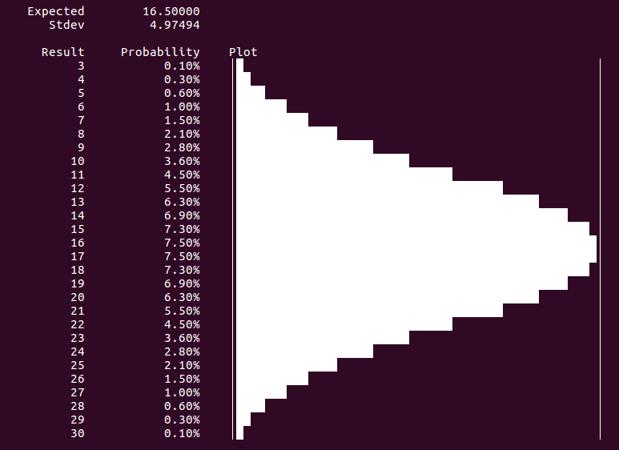
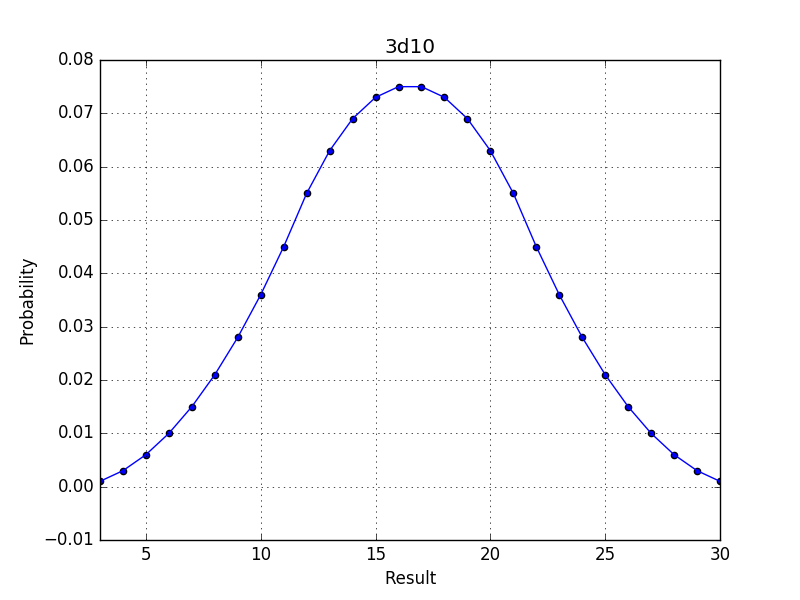

// Copyright (C) 2017 by Jonas Jermann <jjermann2@gmail.com>

# Discrete densities

A python3 module to work with discrete densities.


## Dependencies:
* Python3
* ast, re, op
Used for some basic parsing expressions (not crucial)
* op, heapq, functools.reduce, itertools.product
Used for MultiDensity
* math
Used for gaussMap and stdev
* matplotlib
Used for graphical plotting (plot_image, plotImage)
* median
Used for median


## Files:
* `densities.py`
Main content
  * Defines the following classes:
      * `Density`
      * `Die`
      * `Constant`
      * `Zero`
      * `MultiDensity`
  * Defines the following functions:
      * `get_plot`
      * `get_simple_plot`
      * `plot_image`
      * `AdvantageDie`
      * `DisadvantageDie`
      * `DieExpr`
* `main.py`
Examples on how to use/apply densities.py


## Documentation:
### Density
The module works with discrete distributions (e.g. die rolls).
The main class used everywhere is "Density" which refers to the probability mass function.
See https://en.wikipedia.org/wiki/Probability_mass_function for more information.
Basically a "Density" encodes all possible outcomes of a (discrete) random variable together with their probability.

Let's take the example of a `d20` die roll which is a (discrete) random variable with 20 possible outcomes all with probability 1/20.
These possible outcomes together with their probability are all stored in the density class Die(20).

:warning:
For all operations/methods defined below we assume that the corresponding random variables are independent.

The standard string representation of a density (use `print(density)`) lists all outcomes together
with their probabilites and also gives a (text) plot of the probability mass function.
In addition also the expected value and the standard deviation is displayed.


### Screenshots




### Defining densities
A density can be directly specified by passing it a dictionary of all (key,probability) entries.
For example the following would directly define a `d20` die roll density:

```python3
    densityDict = {}
    for r in range(1, 20):
      densitDict[r] = 1.0 / 20
    d20 = Density(densityDict)
```

However there are already predefined classes for this:

* `Die(n)`
A die with n sides, i.e. n possible outcomes all with probability 1/n
* `Constant(n)`
A constant density, i.e. 1 possibly outcome (`n`) with probability 1
* `Zero`
The constant density for `n=0`
* `AdvantageDie(n)`
The density corresponding to rolling two `Die(n)` and taking the larger result.
* `DisadvantageDie(n)`
The density corresponding to rolling two `Die(n)` and taking the smaller result.
* `MultiDensity(...)`
Used to define more complex densities built from multiple other densities
(see below for more details).

To simplify expressions it is recommended to define abreviations for commonly used densities:

```python3
    d2   = Die(2)
    d3   = Die(3)
    d4   = Die(4)
    d6   = Die(6)
    d8   = Die(8)
    d10  = Die(10)
    d12  = Die(12)
    d20  = Die(20)
    d100 = Die(100)
    ad20 = AdvantageDie(20)
    dd20 = DisadvantageDie(20)
```

### Binary operations between densities
* Addition and Substraction
`D1 + D2` is the density corresponding to adding the two corresponding random variables.

  Example:
  ```python3
    print(d6 + d4)
    print(d6 - d10)
  ```
* Multiplication
`D1 * D2` is the density corresponding to multiplying the two corresponding random variables.
For example `d20+d20` is the density of two added d20 rolls with possible outcomes ranging from 2 to 40.

  Example:
  ```python3
    print(d3*d6)
  ```
* Integers and floats
In place of a density one can also use regular integers and/or floats in operations.
In this case the integer/float is considered a `Constant` density.
For instance `d20 + 10` is the same as `d20 + Constant(10)`, i.e. the
density corresponding to rolling a d20 and adding 10 with outcomes ranging from 11 to 30 (with probabilites 1/20).

  :warning:
  This can be particular confusing with multiplication:
  `2*d20` is the same as `Constant(2)*d20` and *not* the same as `d20+d20`.
  `Constant(2)*d20` corresponds to rolling a d20 and multiplying the result by 2 with outcomes 2, 4, ..., 40 (with probabilities 1/20).
  Adding the same density `n` times can be achieved with the method `arithMult` (see below).
  E.g. `d20 + d20 + d20` is the same as `d20.arithMult(3)`

  Example:
  ```python3
    print(3*d6)
    print(d6 + d6 + d6)
    print(d6.arithMult(3))
  ```
* More general binary operations
An arbitrary binary operations between two densities can be defined using the method `D1.binOp(D2, operation)` where `operation` is a function in two variables `operation(outcome1, outcome2)`
that defines the final outcome in case the outcome of `D1` is `outcome1` and the outcome of `D2` is `outcome2`.

  For example `d20.binOp(d4, lambda a, b: a+b)` gives the same as `d20 + d4` and `d20.binOp(d20, lambda a,b: max(a,b))` gives the same as `d20.with_advantage()`.


### (Unary) operations on densities
The following methods are defined on a given density `d`:

* d.arithMult(n)
Gives the density `d + ... + d` (n times)
* -d
Gives the density `d` with outcomes of opposite sign
* abs(d)
Gives the density `d` with outcomes replaced by their absolute value
* d.conditionalDensity(condition)
Gives the density `d` but only with outcomes that satisfy the given `condition`.
Note that this increases the probability of the remaining outcomes.

  For example `d20.conditionalDensity(lambda a: a<=6)` is the same as `d6`.
* d.with_advantage()
Returns the density `d` corresponding to taking an outcome from `d` twice
and dropping the lower outcome.

  :warning:
Note that densities in general don't keep track of how they were created.
E.g. `(d20 + d6 + d4).with_advantage()` does *not* correspond to rolling a
`d20`, `d6`, `d4` and dropping the lowest. Instead it corresponds to rolling
and adding all three twice and then dropping the lower result of that,
giving a density with outcomes ranging from 3 to 30.
See the section regarding MultiDensity in case you want to define operations on multiple densities.
* d.with_disadvantage()
Returns the density `d` corresponding to taking an outcome from `d` twice
and dropping the higher outcome.
* d.summedDensity(n)
Let's say we add `d` arbitrary often to itself and then we check how many
times (`k`) we had to do the addition to reach at least `n`.
`d.summedDensity(n)` returns the density / probability mass function for `k`.

  For example let's say it takes `d6+d6` minutes to find 1 food portion.
If we keep searching one might ask: How much food can I expect after searching one hour?
The corresponding density / distribution in this case can be found by `(d6+d6).summedDensity(60)`
(with expected value `(d6+d6).summedDensity(60).expected()`).
Here is an example on how to plot the expected number of food portion in terms of how long you search
(both as text plot and as image plot):

  ```python3
    twod6 = d6+d6
    def expectedFood(minutes):
      return twod6.summedDensity(minutes).expected()
    get_plot(expectedFood, range(0, 100+1))
    plot_image(expectedFood, range(0, 100+1))
  ```
* d.roll()
Returns a randomly selected outcome of the density (according to the distribution).
Again the density does not keep track of how it was created only one final result will be returned.

  Example:
  ```python3
    print((d10+d6).roll())
    print((d10+d6).roll())
  ```
* d.asMultiDensity(n)
Returns a `MultiDensity` involving `n` copies of the given density
(i.e. `MultiDensity(d, ..., d)` where `d` occurs `n` times).
See the section on `MultiDensity` for further information...
* d.plot()
Returns a text representation of the density `d`. This is implicitely called when doing `print(d)`.
* d.plotImage(name="plot")
Stores an image representation of the density in a file (default name: "plot.png").
See the section regarding plotting for more information...
* d[n]
Returns the probability for the outcome `n`
* d.keys(), d.values()
Returns the (sorted) possible outcomes resp. the corresponding probabilities
* d.isValid()
Returns if `d` is a valid density (i.e. that the probabilities of all outcomes really add up to 1.0).
* d.expected()
Returns the expected value of the density
* d.variation()
Returns the variation of the density
* d.stdev()
Returns the standard deviation of the density
* d.cdf
Is the cummulative distribution function of the density.
I.e. `d.cdf(n)` gives the probability that `d<=n`.
* d.inverseCdf
Is the inverse cummulative distribution function of the density.
I.e. `d.inverseCdf(p)` returns the smallest outcome `n` such that `d.cdf(n)>=p`.
* d.median()
Returns the median of the density
* d.normalApproximation
Is the (continious) gauss map with the same standard deviation and expected value as the given density
* More general unary operations
An arbitrary unary operation on the given density can be defined using the method `d.op(operation)`
where `operation` is a function in one variable `operation(outcome)`
that defines the final outcome in case the outcome of `d` is `outcome`.

  For example `d20.op(lambda a: max(a))` gives the same as `max(d20)`.


### Probability calculations
For densities the usual comparison and equality operators don't return
boolean results. Instead they return the probability for the given condition.
For example:

* Comparison and Equality operators
The usual comparison operators can be used: `<`, `<=`, `>`, `>=`
The equality operators can be used: `==`, `!=`
The following returns the probability that (d6+d10) is smaller or equal to d8
(including a nice way to print the result as a probability):

  ```python3
    d6+d10 <= d8
    print("{:.4%}".format(d6+d10 <= d8))
  ```
:warning:
As already described in the sections "Integers and floats" one can also be
used in the condition which are then treated as constant densities.
For example `d10 > 7` gives the probability that a d10 roll is larger than 7.
* More general conditions for calculating probabilities
The probability of an arbitrary condition on the density can be calculated
using the method `d.prob(condition)` where condition(outcome) is predicate
function (i.e. it returns whether the corresponding outcome should be included or
not), `d.prob(condition)` then returns the probability that the given
`condition` is satisfied.

  Example:
  ```python3
    d20.prob(lambda a: a!=6 and a<14)
  ```

### Density calculations involving multiple densities
The class `MultiDensity` can be used to do/define operations on multiple densities.
To generate a `MultiDensity` a list of densities have to be passed.

Example:
```python3
    threeD20 = MultiDensity(d20, d20, d20)
```

The `MultiDensity` itself is also a density corresponding to the addition of
the given densities (in this example `d20 + d20 + d20`) and all operations
and methods of regular densities can be done on `MultiDensity` (they don't
take into account the individual densities though, just the final sum).

In addition the following (multi density) methods can be used:

* d.drop_highest(n=1)
Returns a (regular) density corresponding to rolling all defined individual
densities and then dropping the highest `n` rolls of those (default: `n=1`).

  Example:
  ```python3
    multiDensity = MultiDensity(d2, d6, d20)
    print(multiDensity.drop_highest(2))
    print(multiDensity.drop_lowest())
  ```
* d.drop_lowest(n=1)
Returns a (regular) density corresponding to rolling all defined individual
densities and then dropping the lowest `n` rolls of those (default: `n=1`).

  :warning:
Note that `MultiDensity(d2,d6).drop_lowest()` is not the same as `MultiDensity(d2,d6).with_advantage()`.
The first case corresponds to rolling a `d2` and a `d6` and then dropping the lower result of the two.
The second case corresponds to rolling `d2+d6` twice and then dropping the lower result of the two.
In the first case the outcomes range from 1 to 6, in the second case the outcomes range from 2 to 8.
* More general multi density operations
More general multi density operations can be defined using the method
`multiDensity.multiOp(operation)` where `operation` is a function in as many
variables as defined individual densities. `operation(a1, ..., an)`
specifies the desired final outcome in case the outcome of the individual
densities `d1`, ..., `dn` is `a1`, ..., `an`. The final result is a normal
(non-multi) density (with the operation applied on the outcome combinations).

  Example:
  ```python3
    MultiDensity(d3, d6, d20).multiOp(lambda a,b,c: max(a,b,c)-min())
  ```
* More examples
Sometimes one is interested in comparing two rolls in a complicated fashion.
Let's say we compare two rolls and the following function determines the
_winner_ of the two rolls (1 meaning the attacker/first roll wins and 0 the defender/second roll):

  ```python3
    bonusAttacker = 10
    bonusDefender = 0
    def successCondition(attackRoll, defendRoll):
      if (defendRoll == 20):
        return 0
      if (defendRoll == 1):
        return 1
      if (attackRoll + bonusAttacker > defendRoll + bonusDefender):
        return 1
      else:
        return 0
  ```

  We can get the distribution who's winning (i.e. when successCondition is 1 resp. 0) as follows:

  ```python3
    attackerDie = ad20
    defenderDie = d20
    successDensity = MultiDensity(attackerDie, defenderDie).multiOp(successCondition)
  ```

  Of course this could be generalized to more rolls...
Since in this case only two rolls are involved this could also be written as
`attackerDie.binOp(defenderDie, successCondition)`.

  To get the probability that the attacker wins we can simply do:

  ```python3
    successDensity > 0
  ```

  But maybe we want to know the success probability for different values of
`bonusAttacker`, not just `bonusAttacker = 10` and maybe we don't just want
the success probability but also some kind of measure by how much the attacker won.
Let's say we want to know the expected amount by which the attacker wins,
parametrized by `bonusAttacker` (always assuming `bonusDefender=0`) in some range.
We can do this by first parametricing the winAmount condition
(by `bonusAttacker` resp. `bonusDefender`):

  ```python3
    attackerDie = ad20
    defenderDie = d20
    def winAmount(bonusAttacker, bonusDefender):
      def finalAmount(attackRoll, defendRoll):
        if (defendRoll == 20):
          return 0
        if (defendRoll == 1):
          return max(1, (attackRoll + bonusAttacker) - (defendRoll + bonusDefender))
        if (attackRoll + bonusAttacker > defendRoll + bonusDefender):
          return (attackRoll + bonusAttacker) - (defendRoll + bonusDefender)
        else:
          return 0
    def expectedWinAmount(bonusAttacker):
      bonusDefender = 0
      winAmountDensity = MultiDensity(attackerDie, defenderDie).multiOp(winAmount(bonusAttacker, bonusDefender))
      return winAmountDensity.expected()
    get_plot(expectedWinAmount, range(-20,20))
    plot_image(expectedWinAmount, range(-20,20))
  ```

  Note that `expectedWinAmount` is not a density, it's just a function but
there are also some generic plotting methods for functions: `get_plot` for
text plots and `plot_image` for image plots (see the section on Plotting for
more informations).


### Plotting
There are some helper plotting functions defined that are beeing used:

* Text plotting
  ```python3
  get_plot(p, inputs=range(-20, 20+1), plotWidth=50, minP=None, maxP=None, asPercentage=False, centered=True)
  ```
  * `p`
  The function to plot, e.g. `expectedWinAmount`
  * `inputs`
  The function inputs, default: `range(-20, 20 + 1)`
  * `plotWidth`
  The desired plot width, default: 50
  * `minP`, `maxP`
  The desired plotting range.
  If unspecified `minP` is set to the smallest result if that's below zero and to zero if no result is below zero.
  If unspecified `maxP` is set to the maximal result (for probabilities it might make sense to set `maxP=1.0`).
  * `asPercentage`
  Determines if the results are shown as percentages, default: `False`
  * `centered`
  Determines if negative results are drawn _away from the zero line_
or if everything is always drawn from the left up to the value, default: `True` (away from zero)

  If the default values are fine a simple `get_plot(function)` can be used.
If only the second column is disred (e.g. to easily copy the results),
use ``get_simple_plot`` in place of ``get_plot``.

  Example (see above for the definition of `expectedWinAmount` or use a different function):
  ```python3
    print(get_plot(expectedWinAmount))
    print(get_simple_plot(expectedWinAmount))
    print(get_plot(expectedWinAmount, range(-20, 20 + 1), plotWidth = 50, minP = 0.0, maxP = 1.0, centered = True, asPercentage = True))
  ```
* Image plotting
For image plotting the following function can be used:

  ```python3
plot_image(function, inputs=range(-20, 20+1), name=None, xlabel="Input", ylabel="Output", fmt='-', **kwargs)
  ```
  If `name` is not specified then the function name is used if possible, if
that's not possible then `plot` is used. The function will save the image
plot in the file given by the name (as a `.png` file).
The function uses `matplotlib`. For possible plotting formats, other aditional arguments
or in general more complex plotting see:

  https://matplotlib.org/api/_as_gen/matplotlib.pyplot.plot.html#matplotlib.pyplot.plot

  Example:
  ```python3
    plot_image(expectedWinAmount)
  ```
* Text plotting of densities
For densities the method `plot(plotWidth=70)` can be used which internally calls `get_plot`.
Or even more simply `print(density)` can be used...

  Example:
  ```python3
    (d20+d20+d20).plot(90)
    print(d20+d20+d20)
  ```
* Image plotting of densities
For densities the method `plotImage(name="plot")` can be used which internally calls `plot_image`.

  Example:
  ```python3
    (d20+d20+d20).plotImage("3d20")
  ```
* More advanced plotting
For more complex plotting, pyplot should be used directly, example:
  ```python3
    fig = plt.figure()
    plt.title("Duration density given attacker wins")
    plt.xlabel("Duration")
    plt.ylabel("Probability")
    for bonusAttacker in range(-10,10+1):
      d = expectedWinAmount(bonusAttacker).conditionalDensity(lambda k: k>0)
      plt.plot(d.keys(), d.values(), '-')
    plt.savefig("expectedWinAmountAttackerWins")
    plt.close(fig)
  ```

  Here is another example that plots `d20+d20+d20` and it's normal approximation:
  ```python3
    fig = plt.figure()
    plt.title("3d20 and normal approximation")
    plt.xlabel("Roll / Input")
    plt.ylabel("Probability")
    m3d20 = d20 + d20 + d20
    plt.plot(m3d20.keys(), m3d20.values(), '-r')
     normalApproximation = m3d20.normalApproximation
    plt.plot(m3d20.keys(), [normalApproximation(k) for k in m3d20.keys()], '-b')
    plt.savefig("3d20vsNormal")
    plt.close(fig)
  ```
